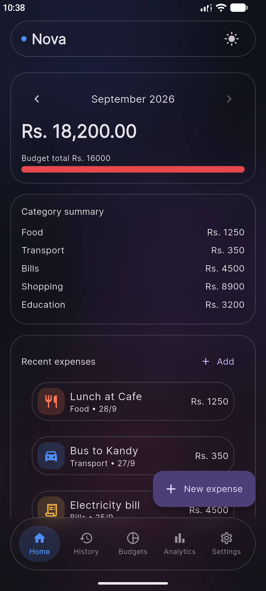
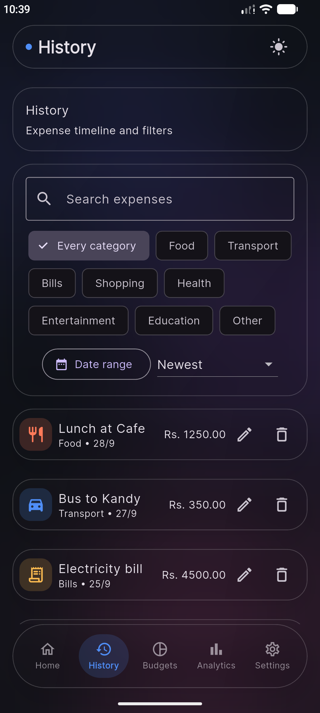
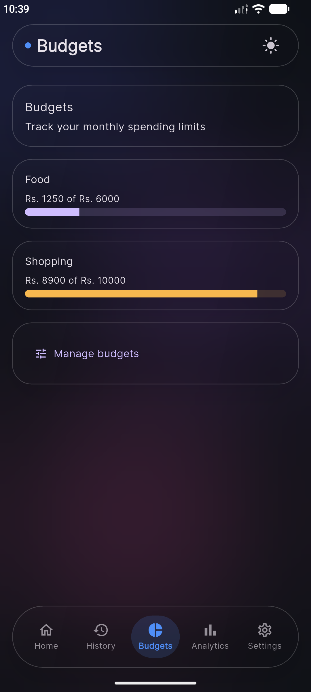
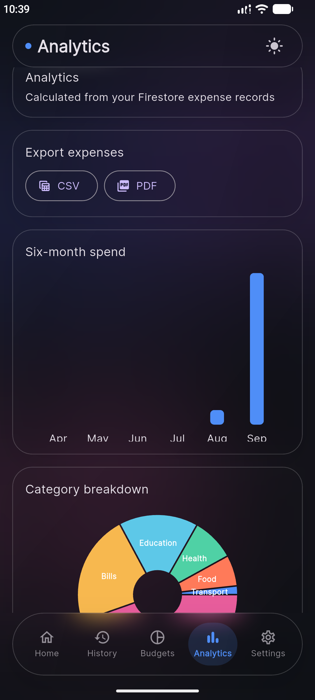
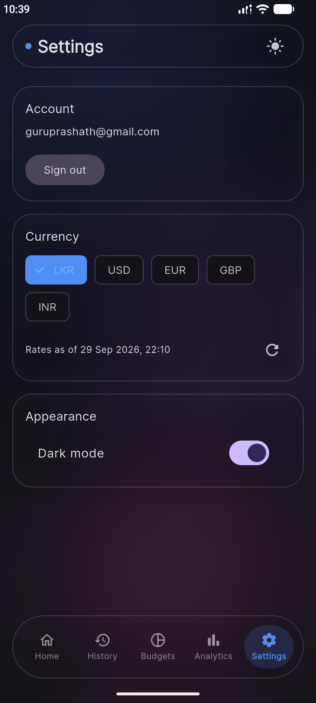

# Nova — Expense Tracker

Nova is a personal expense tracker built with Flutter and Firebase. It uses a
custom Liquid Glass interface and supports live conversion of LKR expenses
into a selected display currency.

Built as the practical task for the CyphLab Flutter Developer Internship.

## Demo

- Screen recording: <https://drive.google.com/file/d/1y7-wvMZGVRAXPGRjSCwbS6Zfm9VmYtYK/view?usp=sharing>
- Release APK: <https://drive.google.com/file/d/1q03S9wxpPKeRt4fzTFqQ7BuhpOvDuJqr/view?usp=sharing>

## Screenshots

| Dashboard | History | Budgets |
|---|---|---|
|  |  |  |

| Analytics | Settings |
|---|---|
|  |  |

## Task requirements

- [x] Add, edit, and delete expenses
- [x] Expense category, title, amount, date, and optional note
- [x] Store expenses in Firebase (Cloud Firestore, with Firebase Authentication)
- [x] Total expenses for the selected/current month
- [x] Expense history list
- [x] Filter expenses by category or date
- [x] Form validation
- [x] Loading, empty, and error states
- [x] Optional features: charts, dark mode, category summary, search, Firebase
  Authentication, budgets, CSV/PDF export, currency conversion

## Features

### Expenses and dashboard

- Create, edit, and delete expenses with a built-in category, date, and
  optional note.
- Validate expense titles, notes, and positive amounts, including grouped
  thousands and decimal-comma input.
- View a total and category summary for a selectable month; the next-month
  control is disabled for the current month.
- View recent expenses and search, filter by category or date range, and sort
  expense history by date or amount.

### Firebase

- Firebase Authentication supports email/password registration, sign-in,
  password reset, and sign-out.
- Cloud Firestore stores user profiles, expenses, and budgets; Firestore rules
  restrict each account to its own data.

### Budgets, analytics, and export

- Create, edit, and delete monthly category budgets with spending progress.
- View a six-month spending chart, category breakdown, and weekday spending
  summary.
- Export expense records to CSV or PDF using the platform share sheet.

### Currency and appearance

- Store expense and budget amounts in LKR and display them in LKR, USD, EUR,
  GBP, or INR.
- Fetch exchange rates from `open.er-api.com`, cache them locally for six
  hours, and fall back to cached or built-in rates if refresh fails.
- Manually refresh exchange rates and view the rate timestamp in Settings.
- Enter expenses and budgets in the selected display currency; the app
  converts entered amounts to LKR before saving.
- Switch between light and dark themes.

### Screen states

- History, budgets, and analytics provide loading, empty, and error/retry
  states. Dashboard data also shows loading and error feedback.

## Tech stack / packages used

- **Flutter / Dart** — cross-platform UI and application code; Dart SDK
  constraint is `>=3.3.0 <4.0.0`.
- **flutter_riverpod** — state management and data providers.
- **firebase_core** — initialize Firebase.
- **firebase_auth** — email/password authentication.
- **cloud_firestore** — cloud database for profiles and user data.
- **go_router** — application navigation and authentication redirects.
- **fl_chart** — dashboard and analytics charts.
- **http** — retrieve public exchange-rate data.
- **shared_preferences** — local currency-rate and theme-preference storage.
- **csv** — create CSV exports.
- **pdf** — create PDF expense reports.
- **share_plus** — share generated export files.
- **google_fonts** — typography.
- **intl** — date, time, and number formatting.
- **uuid** — generate expense document identifiers.
- **flutter_test** and **flutter_lints** (development dependencies) — test
  and lint tooling.

## Setup instructions

### Prerequisites

- Flutter SDK 3.27 or newer with Dart 3.3 or newer.
- Android Studio and Android SDK for Android, or Xcode for iOS.
- A Firebase project.
- Firebase CLI, signed in with `firebase login`, to deploy Firestore rules.
- FlutterFire CLI when configuring the app for a different Firebase project.

### Install dependencies

From the project root:

```bash
flutter pub get
```

### Configure Firebase

FlutterFire configuration files for the Nova Firebase project are included.
In the Firebase console for that project, enable **Email/Password** under
Authentication and create a Cloud Firestore database.

To configure a different Firebase project, install and authenticate the
Firebase CLI, install FlutterFire CLI, then run:

```bash
firebase login
dart pub global activate flutterfire_cli
flutterfire configure
```

Review the generated platform configuration, then enable Email/Password
authentication and create Firestore in the selected Firebase project.

Deploy the Firestore rules and indexes from the project root:

```bash
firebase deploy --only firestore:rules,firestore:indexes
```

### Run the app

Start an Android emulator or connect a device, then run:

```bash
flutter run
```

### Run tests

```bash
flutter test
```

The test suite covers expense model serialization/defaults/copying, amount and
title/note validation, expense search/category/date filtering and sorting,
monthly totals and category summaries, currency conversion/offline fallback,
theme behavior, budget screen behavior, and authentication widgets.

### Build the release APK

```bash
flutter build apk --release
```

The APK is written to `build/app/outputs/flutter-apk/app-release.apk`.

## Firebase data model

- **`users/{uid}`** — `uid`, `email`, `displayName`, `currencyCode`,
  `createdAt`; profile currency updates can also write `updatedAt`.
- **`expenses/{expenseId}`** — `id`, `title`, `category`, `amount`, `date`,
  `note`, `userId`, `createdAt`, `updatedAt`. `amount` is stored in LKR.
- **`budgets/{budgetId}`** — `userId`, `category`, `limit`, `month`,
  `createdAt`, `updatedAt`.

## Project structure

```text
lib/
  app/                 Router and app setup
  core/                Constants, validators, and Liquid Glass UI
  models/              Expense, budget, and profile models
  providers/           Riverpod app state and data providers
  screens/
    home/              Dashboard tab components
  services/            Firebase repositories, currency, and export services
  widgets/             Reusable expense and UI widgets
test/                  Unit and widget tests
docs/screenshots/      App screenshots used in this README
firestore.rules        Owner-scoped Firestore security rules
```

## AI tools used

- **Claude (claude.ai)** — planned the initial architecture, generated and
  refactored code, implemented live currency conversion with offline
  caching/fallback, helped debug issues, wrote tests, and reviewed the final
  implementation against the task requirements.
- **GitHub Copilot (VS Code)** — AI-assisted code completion and
  implementation.

All AI-generated code was reviewed, tested on a real device, and adjusted by
me, and I can explain how each part of the app works.

## Notes / known limitations

- Before using a Firebase project, enable Email/Password authentication,
  create Firestore, and deploy the included rules with
  `firebase deploy --only firestore:rules,firestore:indexes`.
- Firebase configuration currently targets the Nova Firebase project;
  configure another project before connecting to a different backend.
- Live exchange rates depend on the public `open.er-api.com` service. When
  unavailable, the app uses cached rates or the built-in fallback rates.
- Budgets are compared against spending for the selected month but are not
  tracked separately per month.
